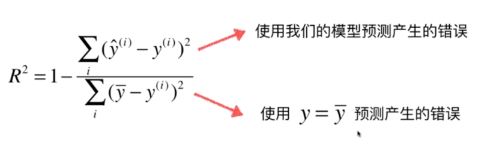

## 线性回归算法
[视频网址](https://www.bilibili.com/video/av37823773/?p=1)

<!-- TOC -->

- [线性回归算法](#线性回归算法)
    - [一：简单线性回归](#一简单线性回归)
            - [1.线性回归的基本知识](#1线性回归的基本知识)
            - [2.线性回归算法](#2线性回归算法)
    - [二：最小二乘法原理](#二最小二乘法原理)
    - [三：简单线性回归的实现](#三简单线性回归的实现)
    - [四：向量化](#四向量化)
    - [五：回归算法评价](#五回归算法评价)
    - [五：多元线性回归和正规方程解](#五多元线性回归和正规方程解)
        - [1.多元线性回归](#1多元线性回归)
        - [2.正规方程解](#2正规方程解)
        - [3.多元线性回归的实现 (正规化方程)](#3多元线性回归的实现-正规化方程)
        - [3.使用sklearn实现多元线性回归](#3使用sklearn实现多元线性回归)

<!-- /TOC -->

### 一：简单线性回归

##### 1.线性回归的基本知识
*   kNN算法主要用于解决分类问题，而线性回归算法主要用于解决回归问题
*   线性回归算法思想非常简单，实现很容易，并且是许多更加强大的非线性模型的基础，无论是多项式回归，逻辑回归还是svm
*   样本特征只有一个称为：简单线性回归，样本特征有多个称为：多元线性回归

##### 2.线性回归算法


*   预测值和真值有一个差距,即为误差
*   构造一个函数，来描述直线拟合的程度：

  


*   要使得上面的差距要尽可能小：


*   使用最小二乘法，求出最小的参数a，b，使得平方误差和（即损失函数）最小


  

### 二：最小二乘法原理
[见视频](https://www.bilibili.com/video/av37823773/?p=2)

### 三：简单线性回归的实现
notebook中的实现:
```python
import numpy as np 
import matplotlib as mpl 
import matplotlib.pyplot as plt

x=np.array([1., 2., 3., 4., 5.])
y=np.array([1., 3., 2., 3., 5.])

plt.scatter(x,y)
plt.axis([0,6,0,6])    #设定x,y的范围

#求均值，后求线性回归的参数a,b
x_mean = np.mean(x)
y_mean = np.mean(y)

num = 0.0   #分子
d = 0.0     #分母
for x_i,y_i in zip(x,y):
    num += (x_i-x_mean) * (y_i-y_mean)
    d += (x_i-x_mean) ** 2
a = num / d                #0.8
b = y_mean - a * x_mean    #0.3999999

#绘制拟合的直线
y_hat = a * x +b  #预测的结果
plt.plot(x,y_hat,color="red")
plt.show()

#预测
x_predict = 6
y_predict = a * x_predict + b
y_predict        #预测的y值

```


pycharm中的封装实现：
```python
import numpy as np

class SimpleLinearRegression1:
    def __init__(self):
        self.a_ = None
        self.b_ = None

    def fit(self, x_train, y_train):
        #根据训练数据即x_train,y_train熟练简单线性回归模型
        assert x_train.ndim == 1, \
            "维度为1"
        assert len(x_train) == len(y_train),\
            "训练集长度相等"

        # 求均值，后求线性回归的参数a,b
        x_mean = np.mean(x_train)
        y_mean = np.mean(y_train)

        num = 0.0  # 分子
        d = 0.0  # 分母
        for x_i, y_i in zip(x_train, y_train):
            num += (x_i - x_mean) * (y_i - y_mean)
            d += (x_i - x_mean) ** 2
        self.a_ = num / d  # 0.8
        self.b_ = y_mean - self.a_ * x_mean  # 0.3999999

        return self

    #预测一个向量 [x1,x2,x3,...]
    def predict(self,x_predict):
        #给定需要预测的x向量，返回预测完成的y向量
        assert x_predict.ndim == 1, \
             "确保一维数组"
        assert self.a_ is not None and self._b is not None,\
            "a_ b_ 要有数据"
        return np.array([self._predict(x) for x in x_predict])      #封装一个仅处理一个x的预测

    #预测单个数据 x_single
    def _predict(self,x_single):
        return self.a_*x_single+self.b_

    #打印函数
    def _repr(self):
        print("SimpleLinearRegression")


if __name__ == '__main__':
    b=SimpleLinearRegression1()
    print("123")
    x = np.array([1., 2., 3., 4., 5.])
    y = np.array([1., 3., 2., 3., 5.])
    x_predict = 6
    reg1 = b.fit(x,y)
    print(reg1.a_)
    print(reg1.b_)

    y_predict = b._predict(x_predict)
    print(y_predict)
```

### 四：向量化
我们之前实现的线性回归性能是比较低的
<font color=red>尝试使用numpy中的向量化运算</font>,巨大的性能差异！


转换为向量点乘
```java
原来的实现：
        # 求均值，后求线性回归的参数a,b
        x_mean = np.mean(x_train)
        y_mean = np.mean(y_train)

        num = 0.0  # 分子
        d = 0.0  # 分母
        for x_i, y_i in zip(x_train, y_train):
            num += (x_i - x_mean) * (y_i - y_mean)
            d += (x_i - x_mean) ** 2
        self.a_ = num / d  # 0.8
        self.b_ = y_mean - self.a_ * x_mean  # 0.3999999


向量化后的实现：
        # 求均值，后求线性回归的参数a,b
        x_mean = np.mean(x_train)
        y_mean = np.mean(y_train)
        
        num = (x_train - x_mean).dot(y_train-y_mean)    //num += (x_i - x_mean) * (y_i - y_mean)  
        d = (x_train-x_mean).dot(x_train-x_mean)        // d += (x_i - x_mean) ** 2

        注意：这里的向量减去一个值，是向量中的每一个元素都要减去这个值


性能测试：
m = 1000000
#生成一组数据规模为100万的数据
big_x = np.random.random(size=m)
big_y = big_x * 2.0 + 3.0 + np.random.normal(0,1,size=m)

传入类中的fit方法中，查看性能差异
%timeit reg1.fit(big_x,big_y)
%timeit reg2.fit(big_x,big_y)
```

&nbsp;
### 五：回归算法评价  
&nbsp;

和m是有关的  
&nbsp;
所以衡量标准应该为:
*   均方误差 RMSE

&nbsp;
*   均方根误差 MSE

&nbsp;

*   平均绝对误差 MAE


```python
import numpy as np
import matplotlib as mpl 
from sklearn import datasets

#波士顿房产数据
boston= datasets.load_boston()
boston.data
#print(boston.DESCR)   #506个数据，13个特征
boston.feature_names
x = boston.data[:,5]   #只是用房间数量 RM
x.shape                #506  

y = boston.target
#plt.scatter(x,y)    #最上面有一排y相同的点，是数据达到阈值之后设定的统一的值为50

np.max(y)

x = x[y<50.0]       #过滤一下数据
y = y[y<50.0]
plt.scatter(x,y) 

#将x，y进行训练数据和测试数据的划分，然后调用线性回归算法训练
x_train, x_test, y_train, y_test = train_test_split(x, y, test_size=0.25, random_state=0)  #随机选择25%作为测试集，剩余作为训练集
x_train
x_test
y_train
y_test

#接下来求几个衡量标准，比较即可
```  

**最好的衡量标准 R Squared**




下面的y均值那个，就是所谓的baseline model，即最基本的model

**R^2**
*   R^2 <= 1
*   R^2越大越好，模型完全不犯错误，则=1
*   当我们的模型等于基准模型，则R^2为0
*   当R^2小于0，则说明我们的模型还不如基准模型baseline model,此时，很有可能我们的数据不存在任何线性关系


### 五：多元线性回归和正规方程解

#### 1.多元线性回归

*   多元线性回归表达式的变形


&nbsp;
*   多元线性回归的向量表示


*   多元线性回归的目标
&nbsp;&nbsp;&nbsp;&nbsp;&nbsp;&nbsp;

#### 2.正规方程解
*   最小二乘法(在整个矩阵上进行求导)

&nbsp;&nbsp;&nbsp;&nbsp;&nbsp;&nbsp;&nbsp;&nbsp;&nbsp;&nbsp;&nbsp;&nbsp;

<font color=red>缺点</font>：上面的这个式子就是正规方程解，但是这个式子求解的时间复杂度比较高，o(n^3)，即使优化，也要达到o(n^2.4),这个时间复杂度还是很高的。

并且正规方程解只能应用于线性回归

<font color=red>优点</font>：不需要对数据做归一化处理

#### 3.多元线性回归的实现 (正规化方程)


将截距和系数分开封装
```python
import numpy as np
import matplotlib as mpl 
from sklearn import datasets

class LinearRegression:
    def __init__(self):
        """ 初始化 LinearRegression 模型 """
        self.coef_ = None           #系数
        self.interception_ = None   #截距
        self._theta = None

    #训练
    def fit_normal(self,x_train,y_train):
        assert x_train.shape[0] == y_train.shape[0],\
            "x_train的样本数量和y_train的标记数量一致"
        x_b = np.hstack([np.ones(len(x_train),1),x_train])          #添加一列,全1
        #利用正规方程求解 theta
        self._theta = np.linalg.inv(x_b.T.dot(x_b)).dot(x_b.T).dot(y_train)

        self.coef_ = self._theta[1:]          #得到系数
        self.interception_ = self._theta[0]   #得到截距
        return self

    #预测
    def predict(self,x_predict):
        #给定需要预测的x向量，返回预测完成的y向量
        assert self.interception_ is not None and self.coef_ is not None, \
            "coef_ interception_ 要有数据"
        assert self.predict().shape[1] == len(self.coef_),\
            ""
        #根据要预测的x，重新构建 theta
        x_b = np.hstack([np.ones(len(x_predict), 1), x_predict])
        return x_b.dot(self._theta)       #直接乘以theta，即可得到预测的结果

    #评价结果
    def score(self,x_test,y_test):
        #根据测试数据 x_text y_text 确定当前模型的准确度
        y_predict = self.predict(x_test)
        #return r2_score(y_test,y_predict)      #求真值和预测值之间的R^2指标

    #打印
    def _repr(self):
        print("LinearRegression")

if __name__ == '__main__':
    #波士顿房产数据
    boston= datasets.load_boston()
    x=boston.data
    
    x = x[y<50.0]       #过滤一下数据
    y = y[y<50.0]
    #plt.scatter(x,y) 

    #将x，y进行训练数据和测试数据的划分，然后调用线性回归算法训练
    x_train, x_test, y_train, y_test = train_test_split(x, y, test_size=0.25, random_state=0)  #随机选择25%作为测试集，剩余作为训练集

    #调用写好的类训练即可
```

#### 3.使用sklearn实现多元线性回归
```python
import numpy as np
import matplotlib as mpl 
from sklearn import datasets
from sklearn.model_selection import train_test_split
from sklearn.linear_model import LinearRegression

#波士顿房产数据
boston= datasets.load_boston()
x= boston.data
#print(boston.DESCR)   #506个数据，13个特征
boston.feature_names
#x = boston.data[:,5]   #只是用房间数量 RM
x.shape                #506  

y = boston.target

x = x[y<50.0]       #过滤一下数据
y = y[y<50.0]


#将x，y进行训练数据和测试数据的划分，然后调用线性回归算法训练
x_train, x_test, y_train, y_test = train_test_split(x, y, test_size=0.25, random_state=0)  #随机选择25%作为测试集，剩余作为训练集

#使用sklearn 实现线性回归
lin_reg = LinearRegression()
lin_reg.fit(x_train,y_train)

lin_reg.coef_        #获取系数矩阵
lin_reg.intercept_   #获取截距

lin_reg.score(x_test,y_test)     #0.7655923875366033
```


