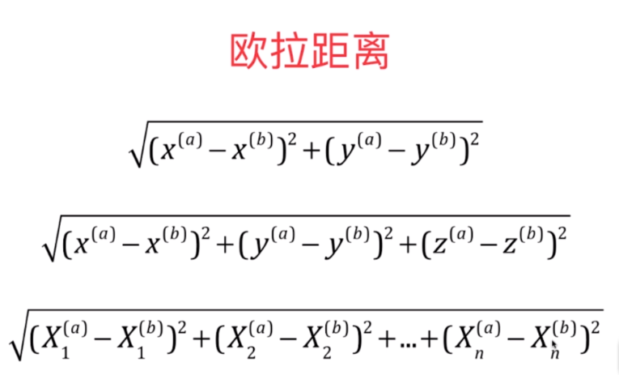

### KNN算法 - K近邻算法

#### 一.算法基础
##### 1.特点
*   思想很简单
*   应用数学知识少
*   效果好
*   可以解释机器学习算法使用过程中的一些细节问题
*   更完整的刻画机器学习应用的流程

##### 2.kNN的思想
求与一个点最近的几个点,来标识该点最有可能是出现什么情况。
点与点之间的距离用 欧拉距离求：(使用哪种公式，取决于有多少特征)

&nbsp;&nbsp;&nbsp;&nbsp;&nbsp;&nbsp;&nbsp;&nbsp;&nbsp;&nbsp;&nbsp;&nbsp;&nbsp;&nbsp;&nbsp;&nbsp;&nbsp;&nbsp;&nbsp;&nbsp;&nbsp;&nbsp;&nbsp;&nbsp;&nbsp;&nbsp;</img>

python中kNN的实现：
```python
import numpy as np
import matplotlib.pyplot as plt

raw_data_x = [
    [3.393544211,2.331273381],
    [3.110073483,1.78159638],
    [1.343808831,3.368360954],
    [3.582294042,4.679179110],
    [2.280362439,2.866990263],
    [7.423436942,4.696522875],
    [5.745051997,3.533989803],
    [9.172168622,2.511101045],
    [7.792783481,3.424088941],
    [7.792783481,3.424088941]
]
raw_data_y = [0,0,0,0,0,1,1,1,1,1]
len(raw_data_y)

X_train = np.array(raw_data_x)
Y_train = np.array(raw_data_y)

x = np.array([8.093607318,3.365731514])

from math import sqrt 
#kNN的过程
distances = []
for x_train in X_train:
    d = sqrt(np.sum((x_train - x)**2))
    distances.append(d)          #存放预测的点和每一个点的距离
distances = [ sqrt(np.sum((x_train - x)**2)) for x_train in X_train]     #或者直接这样就可以
distances

nearset = np.argsort(distances)    #array([ 8,  9,  7,  5,  6, 10,  3,  0,  1,  4,  2], dtype=int64)   获取从近到远的点

k = 6

topK_y = [y_train[i] for i in nearset[:k]]    #前k个近的点
topK_y

from collections import Counter
votes = Counter(topK_y)      #作统计 Counter({1: 5, 0: 1}) 表示数组中 值为1的由5个 值为0的有1个
votes.most_common(1)         #取票数最多的一个元素  [(1, 5)]
votes.most_common(1)[0]      #1 取出这个元素,根据knn算法，新来的元素预测是1
```
